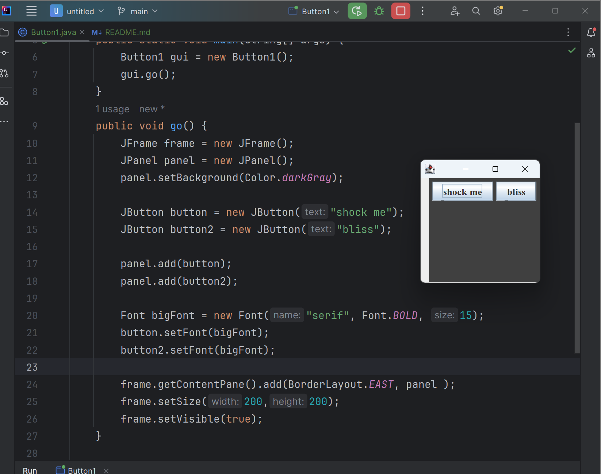
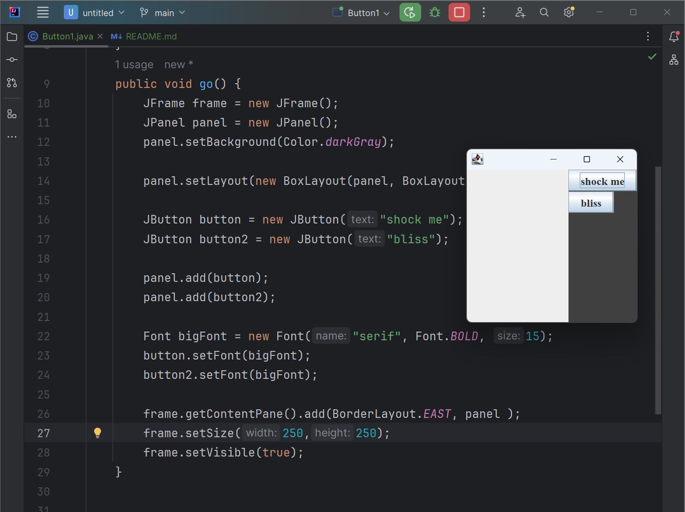
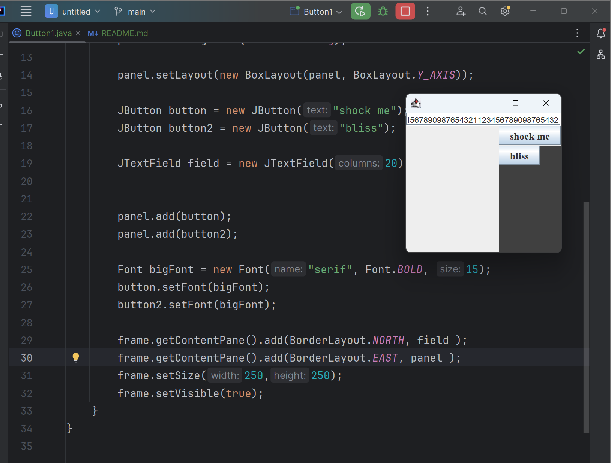
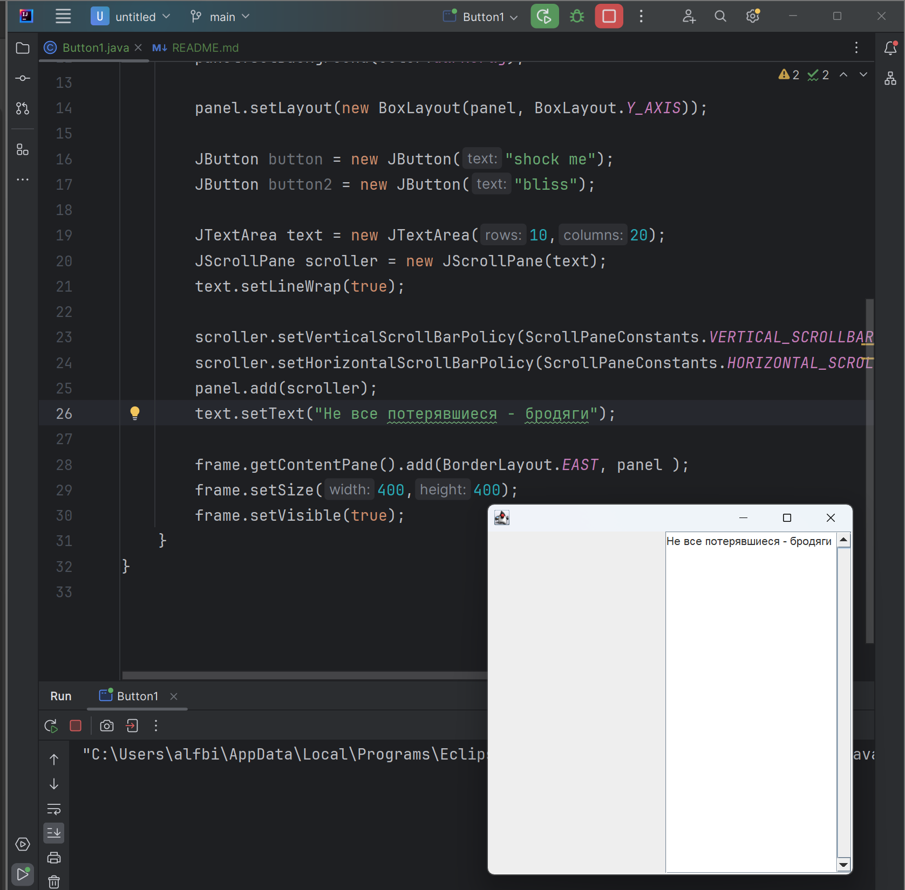
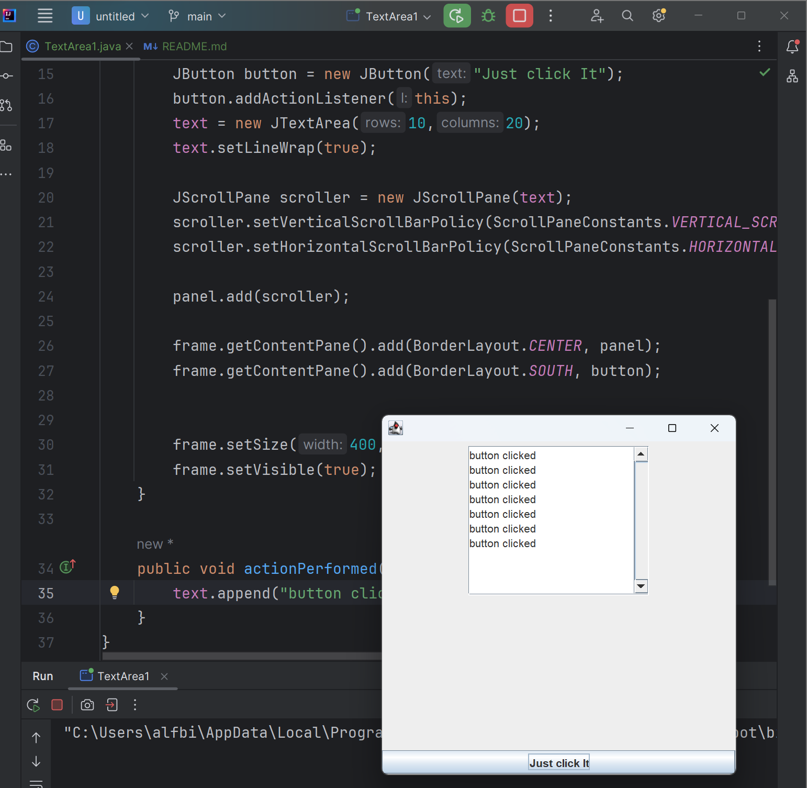
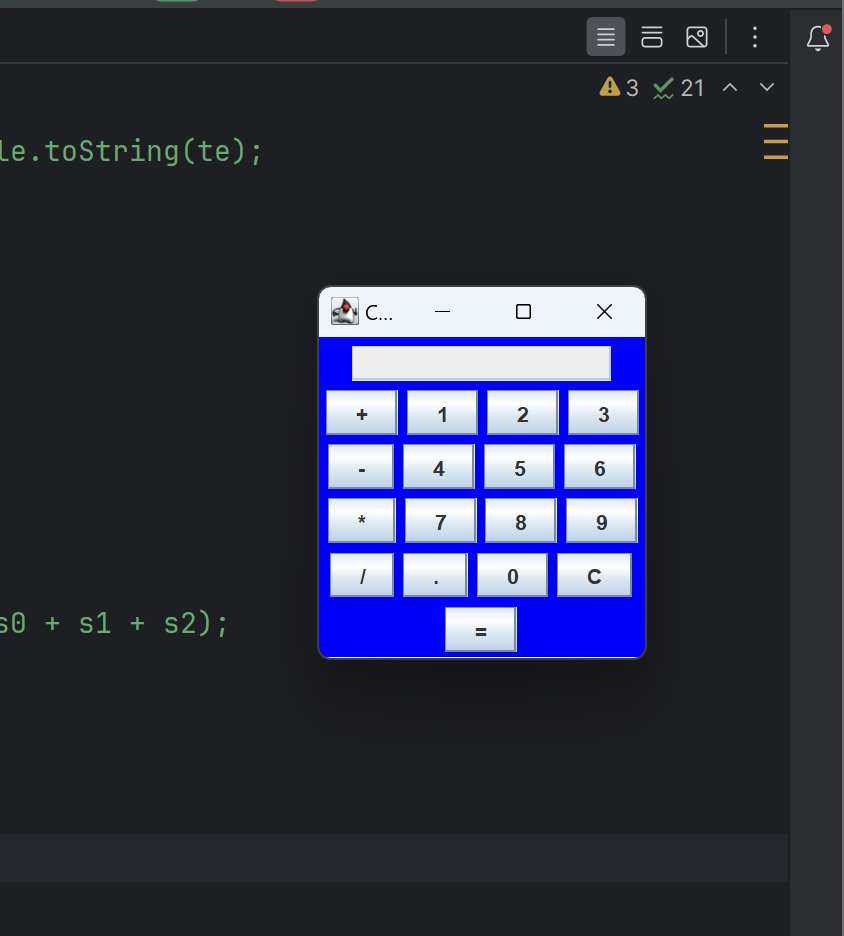
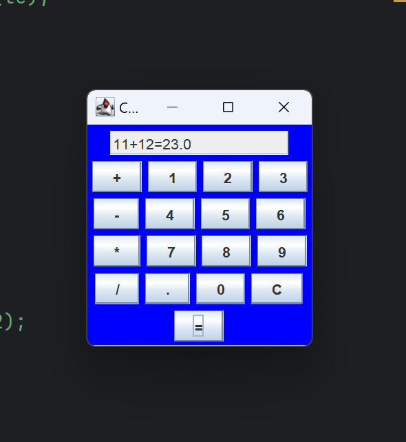

# Тема 16

### Добавим кнопку в область east:


### Добавим кнопку  область north


### Теперь сделаем так, чтобы кнопка попросила стать выше


### Что произойдет, если мы добавим две кнопки на панель?


### BoxLayout спешит на помощь


## Играем со swing-компонентами
### JTextField


### JTextArea




## Калькулятор 

``` Java
import javax.swing.*;
import java.awt.*;
import java.awt.event.ActionEvent;
import java.awt.event.ActionListener;

class Calculator extends JFrame implements ActionListener {
    static JFrame frame;
    static JTextField text;
    String s0, s1, s2;

    Calculator() {
        s0 = s1 = s2 = "";
    }

    public static void main(String[] args) {
        Calculator c = new Calculator();

        frame = new JFrame("Calculator");

        text = new JTextField(16);

        text.setEditable(false);


        JButton btn0, btn1, btn2, btn3, btn4, btn5, btn6, btn7, btn8, btn9, btnAdd, btnSubstract, btnDivide, btnMultyply, btnPoint, btnErase, btnEqual;

        btn0 = new JButton("0");
        btn1 = new JButton("1");
        btn2 = new JButton("2");
        btn3 = new JButton("3");
        btn4 = new JButton("4");
        btn5 = new JButton("5");
        btn6 = new JButton("6");
        btn7 = new JButton("7");
        btn8 = new JButton("8");
        btn9 = new JButton("9");


        btnEqual = new JButton("=");


        btnAdd = new JButton("+");
        btnSubstract = new JButton("-");
        btnDivide = new JButton("/");
        btnMultyply = new JButton("*");
        btnErase = new JButton("C");


        btnPoint = new JButton(".");

        JPanel panel = new JPanel();

        btnMultyply.addActionListener(c);
        btnDivide.addActionListener(c);
        btnSubstract.addActionListener(c);
        btnAdd.addActionListener(c);
        btn9.addActionListener(c);
        btn8.addActionListener(c);
        btn7.addActionListener(c);
        btn6.addActionListener(c);
        btn5.addActionListener(c);
        btn4.addActionListener(c);
        btn3.addActionListener(c);
        btn2.addActionListener(c);
        btn1.addActionListener(c);
        btn0.addActionListener(c);
        btnPoint.addActionListener(c);
        btnErase.addActionListener(c);
        btnEqual.addActionListener(c);

        panel.add(text);
        panel.add(btnAdd);
        panel.add(btn1);
        panel.add(btn2);
        panel.add(btn3);
        panel.add(btnSubstract);
        panel.add(btn4);
        panel.add(btn5);
        panel.add(btn6);
        panel.add(btnMultyply);
        panel.add(btn7);
        panel.add(btn8);
        panel.add(btn9);
        panel.add(btnDivide);
        panel.add(btnPoint);
        panel.add(btn0);
        panel.add(btnErase);
        panel.add(btnEqual);


        panel.setBackground(Color.blue);


        frame.add(panel);

        frame.setSize(200, 220);
        frame.show();
    }


    @Override
    public void actionPerformed(ActionEvent e) {

        String s = e.getActionCommand();

        if ((s.charAt(0) >= '0' && s.charAt(0) <= '9') || s.charAt(0) == '.') {

            if (!s1.equals(""))
                s2 = s2 + s;
            else
                s0 = s0 + s;


            text.setText(s0 + s1 + s2);
        } else if (s.charAt(0) == 'C') {

            s0 = s1 = s2 = "";


            text.setText(s0 + s1 + s2);
        } else if (s.charAt(0) == '=') {

            double te;


            if (s1.equals("+"))
                te = (Double.parseDouble(s0) + Double.parseDouble(s2));
            else if (s1.equals("-"))
                te = (Double.parseDouble(s0) - Double.parseDouble(s2));
            else if (s1.equals("/"))
                te = (Double.parseDouble(s0) / Double.parseDouble(s2));
            else
                te = (Double.parseDouble(s0) * Double.parseDouble(s2));

            text.setText(s0 + s1 + s2 + "=" + te);


            s0 = Double.toString(te);

            s1 = s2 = "";
        } else {

            if (s1.equals("") || s2.equals(""))
                s1 = s;

            else {
                double te;


                if (s1.equals("+"))
                    te = (Double.parseDouble(s0) + Double.parseDouble(s2));
                else if (s1.equals("-"))
                    te = (Double.parseDouble(s0) - Double.parseDouble(s2));
                else if (s1.equals("/"))
                    te = (Double.parseDouble(s0) / Double.parseDouble(s2));
                else
                    te = (Double.parseDouble(s0) * Double.parseDouble(s2));


                s0 = Double.toString(te);


                s1 = s;


                s2 = "";
            }


            text.setText(s0 + s1 + s2);
        }
    }
}
```


